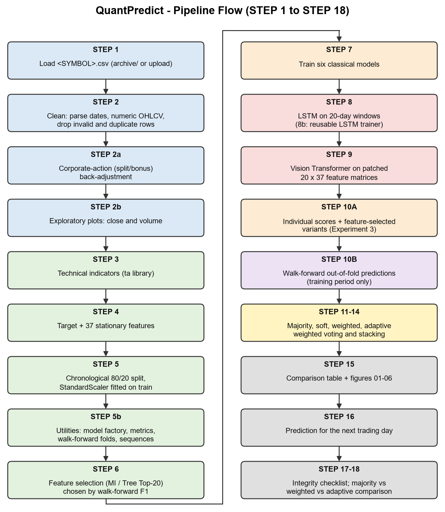

# QuantPredict

Next-day stock direction prediction with machine learning, an LSTM, a Vision Transformer and adaptive ensemble voting, tested on every NIFTY-50 stock.

**Live results site: https://quantpredict.netlify.app**

On the site you can pick any of the 49 stocks, explore every model and voting rule, see each day's prediction on the test period, and download the plots and tables.

## The question

For each trading day *t*, predict one label:

```
Target[t] = 1 (UP)    if Close[t+1] > Close[t]
            0 (DOWN)  otherwise
```

The project compares 8 models and 15 ways of combining them, all scored on the same unseen days. Every tuning choice is made inside the training years, and 18 automated checks confirm that no future information leaks into training.

- **Models:** Logistic Regression, Random Forest, Gradient Boosting, XGBoost, SVM, KNN, an LSTM on 20-day windows, and a Vision Transformer that reads each 20 × 37 feature window as a patched image.
- **Voting rules:** majority, soft, F1-weighted, adaptive weighted (weights recomputed daily from recent accuracy) and stacking, each with 7 models, plus an experimental 8-model version that adds the ViT.
- **Features:** 37 stationary technical features (MACD, RSI, ADX, Bollinger bands, ATR, OBV, moving-average distances, volatility, lags).
- **Evaluation:** a chronological 80/20 split, with walk-forward validation inside the training period to set weights and pick feature sets.



## Results across all 49 stocks

46,575 test days in total, from daily NSE data covering January 2000 to April 2021.

| | Mean test accuracy |
|---|---|
| Always guess the stock's more common direction (baseline) | **51.6%** |
| Best single model on average (LSTM) | 51.0% |
| Average single model | 50.6% |
| Best voting rule on average (adaptive weighted, labels, 8 models) | 50.8% |

- **No single model beats the simple baseline on average.** Every model lands within about a point of a coin flip.
- **Ensembles are steadier, not smarter.** They beat the average single model on up to 30 of 49 stocks, but beat each stock's best single model on at most 5 of 49.
- **The Vision Transformer adds nothing measurable.** Adding it to an ensemble won 172 of 343 stock-by-rule comparisons, close to half.
- **Feature selection doesn't help on average.** Walk-forward validation preferred the Tree Top-20 set on 25 stocks, MI Top-20 on 15 and all 37 features on 9.
- **All 18 leakage checks passed on every stock.**

For Reliance Industries, the stock the project report studies in depth, Gradient Boosting reached 53.6% and adaptive weighted voting 52.1%. Both are inside the ±3-point range that chance alone produces over about 1,000 test days.

## Repository layout

| Path | What it is |
|---|---|
| `Quantpredict.py` | The full pipeline (STEP 1–18), runnable in Colab or locally |
| `archive/` | NSE daily price files for the NIFTY-50 stocks, plus metadata |
| `batch/` | Runs the pipeline for every stock and exports the results |
| `website/` | Source for the results site and its build script |
| `docs/` | The built site (deployed to Netlify) |
| `report_diagrams/` | Figures used in the project report |
| `QuantPredict_Final_Project_Report.docx` | Project report |
| `QuantPredict_Final_Review.pptx` | Review presentation |

## Running it

**Google Colab:** run `Quantpredict.py` as a single cell. It installs `ta` and `xgboost` itself, and asks you to upload a stock CSV if it can't find one.

**Locally:**

```bash
pip install numpy pandas scikit-learn xgboost ta matplotlib seaborn torch
```

```bash
python Quantpredict.py
```

The default stock is RELIANCE. To pick another, set `STOCK_SYMBOL` at the top of the script or the `QP_STOCK_SYMBOL` environment variable to any file name in `archive/` (for example `TCS` or `INFY`). Figures and result tables are written to `outputs/`. TensorFlow is used for the LSTM and ViT if it's installed, otherwise PyTorch.

**All stocks at once:**

```bash
python batch/run_all.py
```

This runs four stocks in parallel and resumes where it left off if interrupted. It takes about 45 minutes on a 32-thread CPU. To rebuild the website from the results afterwards, run `python website/build_site.py`. See [website/README.md](website/README.md) for previewing and deploying.

## Data

Rao, R. (2021). *NIFTY-50 Stock Market Data (2000–2021)* [Data set]. Kaggle. https://www.kaggle.com/datasets/rohanrao/nifty50-stock-market-data

## Author

Aditya Rai, B.Tech Information Technology, VIT Vellore. Project guide: Dr. Brijendra Singh, SCORE.

## Disclaimer

This is an academic comparison of models. It is not financial advice, and next-day accuracy near 50% is not a trading strategy.
